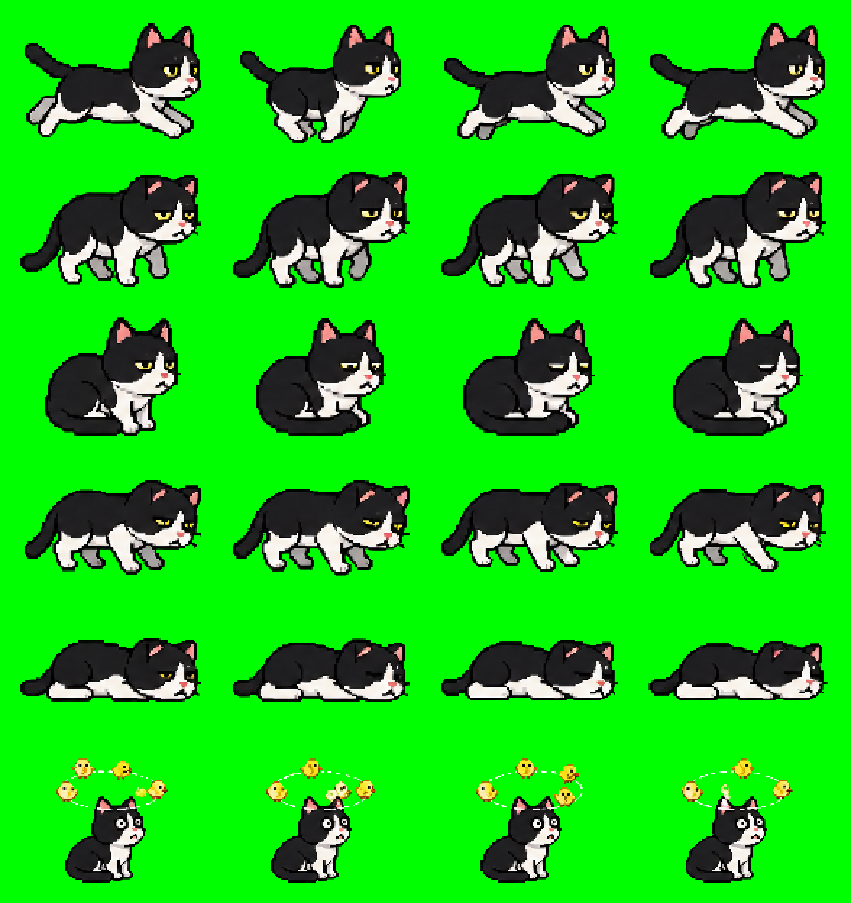

# TokenCat

TokenCat は、AI 作業を見守る macOS メニューバーの小さな相棒です。

Claude Code や Codex の使用状況に合わせて、猫の元気が変わります。AI と一緒に作業している時間を、少しだけ楽しく、少しだけ安心できるものにするための常駐アプリです。



## Concept

AI をただのツールとして使うだけでなく、メニューバーに小さな生き物が住んでいるような感覚で付き合えるアプリを目指しています。

今は猫が Claude Code / Codex の使用状況を見守ります。今後は犬、うさぎ、ロボットなど、動かせる相棒を増やしていく予定です。

## Download

配布用アプリは GitHub Releases で公開予定です。

現在のビルド成果物は `TokenCat vol.N.app` の形式で作成されます。変更履歴と古いバージョンは Git/GitHub のブランチ、コミット、タグ、リリースで管理します。

## Features

- macOS メニューバーに住むドット絵の猫
- Claude Code または Codex の使用状況に合わせて変わるアニメーション
- 残り使用率のメニューバー表示
- 取得対象を `Claude Code` または `Codex` から選択
- `Target` / `Overall Used` / `Remaining` / `現在の状態` のサマリー表示
- 状態が変わったときの macOS 通知
- 手動更新、更新間隔設定、ログイン時自動起動
- 日本語 / 英語対応
- PNG フレームが読めない場合の絵文字フォールバック

## Cat States

猫の状態は、残り使用率から決まります。

| Remaining | State |
| --- | --- |
| 70-100% | `running` |
| 40-69% | `tiredRunning` |
| 20-39% | `sleepyRunning` |
| 5-19% | `exhaustedWalking` |
| 0-4% | `collapsed` |

## Roadmap

TokenCat は無料で使えるアプリとして育てていく予定です。

今後の候補:

- 追加の動物
- 季節限定スキン
- AI ごとの相棒切り替え
- アニメーションやテーマの追加
- App Store 配布
- 追加相棒の買い切りアンロック

「次に追加してほしい相棒」や使ってみた感想があれば、Issue やレビューで教えてください。反応が多いものから優先して作っていきます。

## How It Works

TokenCat は、Mac 上でログイン済みの CLI 認証情報を使って使用状況を取得します。

- Claude Code: macOS Keychain の `Claude Code-credentials` から OAuth トークンを読み、Anthropic の usage endpoint を呼び出します。
- Codex: `codex app-server` を起動し、line-delimited JSON-RPC で rate limit を取得します。

取得するのは、設定画面で選ばれている対象だけです。

## Build

Requirements:

- macOS 14 Sonoma or later
- Swift 5.9 or later
- Claude Code CLI, if using Claude Code
- Codex CLI, if using Codex

Build the app:

```bash
./Scripts/build.sh
```

The script creates:

```text
TokenCat.app
TokenCat vol.N.app
```

`TokenCat vol.N.app` がすでに存在する場合、上書きや `_archive/` への退避は行いません。新しい `--vol` を指定するか、不要なビルド成果物を手動で整理してください。

公開コピーを作らずにビルドだけ確認する場合:

```bash
./Scripts/build.sh --clean --no-publish
```

## Resources

Cat animation frames live in:

```text
Resources/CatFrames/
```

Expected file names:

- `running_0.png` ... `running_3.png`
- `tired_0.png` ... `tired_3.png`
- `sleepy_0.png` ... `sleepy_3.png`
- `exhausted_0.png` ... `exhausted_3.png`
- `collapsed_0.png` ... `collapsed_3.png`
- `unavailable_0.png` ... `unavailable_3.png`

Small transparent PNGs around 22x18 points work best in the macOS menu bar.

## Privacy

TokenCat does not include analytics.

Tokens are read locally at runtime and are not stored by this app. Usage data is sent only to the service required for the selected target.

Status change notifications are local macOS notifications. No notification data is sent to an external server by TokenCat.

## Uninstall

Quit TokenCat, then remove the app bundle.

```bash
rm -rf "TokenCat vol.N.app"
defaults delete com.tokencat.app 2>/dev/null
```

## License

Distributed under the [MIT License](./LICENSE).

TokenCat is based on [`token-checker`](https://github.com/otoha1119/token-checker) by otoha1119, distributed under the MIT License.

TokenCat also includes UI design portions derived from [`ccmeter`](https://github.com/s-age/ccmeter), distributed under the MIT License by s-age.

## Disclaimer

This is an unofficial third-party tool. "Anthropic", "Claude", "Claude Code", "OpenAI", and "Codex" are trademarks of their respective owners. This project is not affiliated with, endorsed by, or sponsored by Anthropic or OpenAI.
